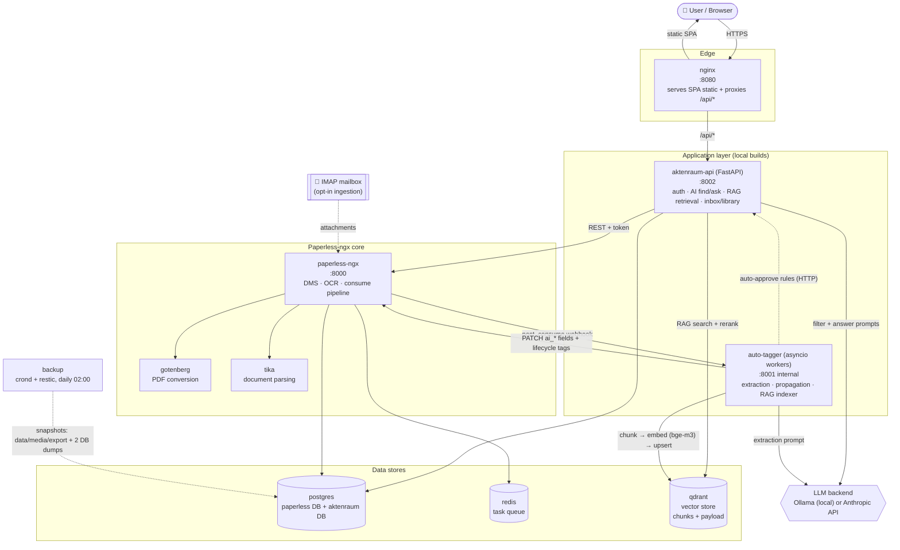
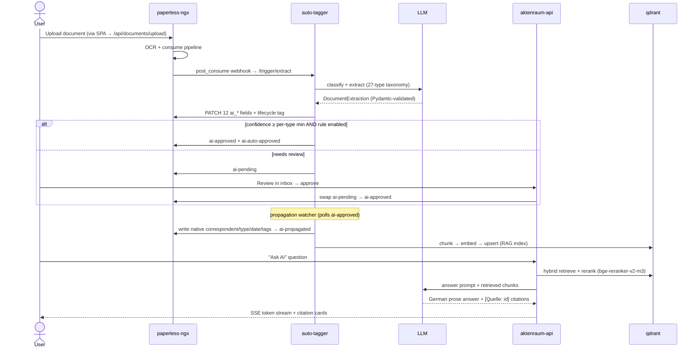
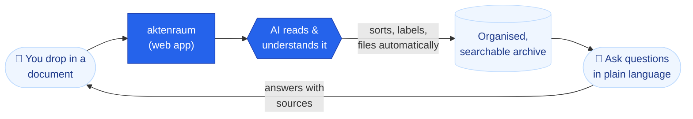
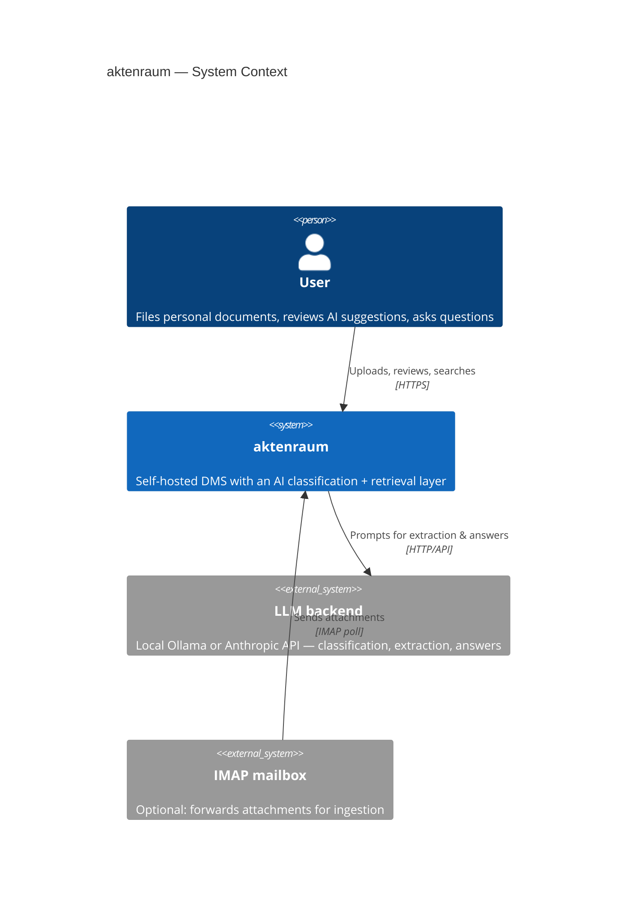
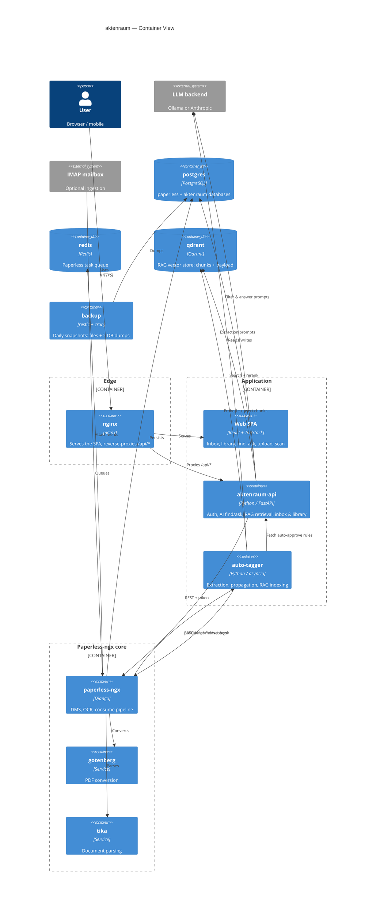
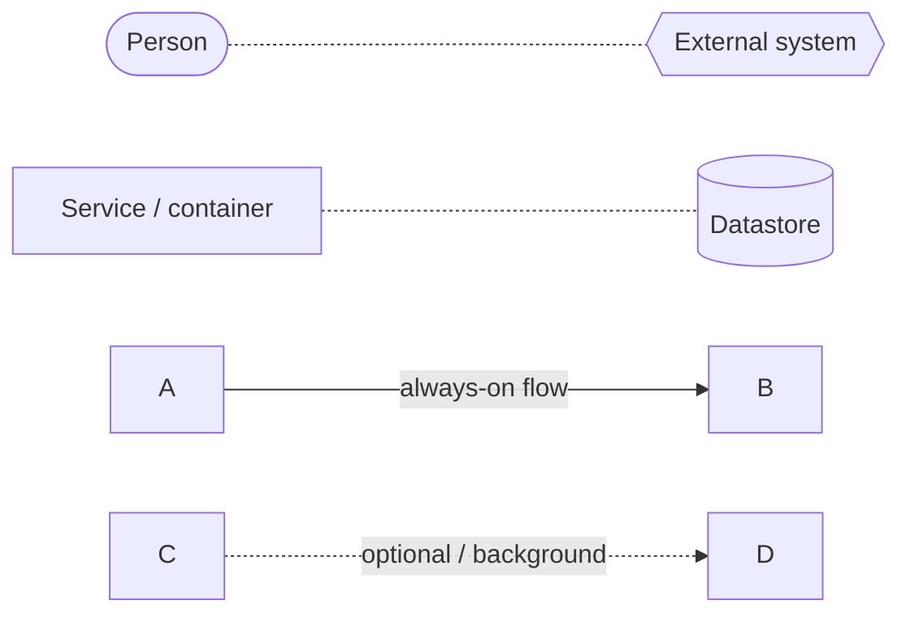

# aktenraum — architecture diagrams

Portfolio-ready diagrams of the aktenraum stack in three text formats. Pick one:

- **Mermaid** — renders natively on GitHub, GitLab, Notion, Obsidian, Docusaurus, MkDocs-Material. Best default.
- **D2** ([d2lang.com](https://d2lang.com)) — nicer auto-layout; needs the `d2` CLI or a plugin to render.
- **ASCII** — zero tooling, drops into any monospace block.

---

## Mermaid — system architecture (topology + data flow)



## Mermaid — document lifecycle (sequence)



---

## D2 — system architecture

```d2
user: 👤 User / Browser {shape: person}
llm: LLM backend\nOllama (local) or Anthropic API {shape: hexagon}
mail: 📧 IMAP mailbox\n(opt-in) {shape: page}

edge: Edge {
  nginx: nginx :8080\nSPA static + proxy /api/*
}

app: Application layer (local builds) {
  api: aktenraum-api (FastAPI) :8002\nauth · AI find/ask · RAG · inbox/library
  tagger: auto-tagger (asyncio) :8001\nextraction · propagation · indexer
}

paperless_core: Paperless-ngx core {
  paperless: paperless-ngx :8000\nDMS · OCR · consume
  gotenberg: gotenberg\nPDF conversion
  tika: tika\ndocument parsing
}

data: Data stores {
  pg: postgres\npaperless + aktenraum DBs {shape: cylinder}
  redis: redis\ntask queue {shape: cylinder}
  qdrant: qdrant\nvector store {shape: cylinder}
}

backup: backup\ncrond + restic daily 02:00

user -> edge.nginx: HTTPS
edge.nginx -> app.api: /api/*
edge.nginx -> user: static SPA

app.api -> paperless_core.paperless: REST + token
app.api -> data.qdrant: RAG search + rerank
app.api -> llm: filter + answer prompts
app.api -> data.pg

mail -> paperless_core.paperless: attachments {style.stroke-dash: 3}
paperless_core.paperless -> paperless_core.gotenberg
paperless_core.paperless -> paperless_core.tika
paperless_core.paperless -> data.pg
paperless_core.paperless -> data.redis
paperless_core.paperless -> app.tagger: post_consume webhook

app.tagger -> llm: extraction prompt
app.tagger -> paperless_core.paperless: PATCH ai_* fields + lifecycle tags
app.tagger -> data.qdrant: chunk -> embed (bge-m3) -> upsert
app.tagger -> app.api: auto-approve rules (HTTP) {style.stroke-dash: 3}

backup -> data.pg: snapshots: data/media/export + 2 DB dumps {style.stroke-dash: 3}
```

---

## ASCII — system architecture

```
                              👤 User / Browser
                                      │ HTTPS
                                      ▼
                          ┌───────────────────────┐
                          │  nginx  :8080          │  ◀── EDGE
                          │  SPA static + /api/*   │
                          └───────────┬───────────┘
                                      │ /api/*
                                      ▼
   ┌──────────────────────────────────────────────────────────────────┐
   │  APPLICATION (local builds)                                        │
   │                                                                    │
   │   ┌──────────────────────────┐      ┌───────────────────────────┐ │
   │   │ aktenraum-api (FastAPI)   │◀────▶│ auto-tagger (asyncio)     │ │
   │   │ :8002                     │ rules│ :8001 internal            │ │
   │   │ auth · find/ask · RAG     │      │ extraction · propagation  │ │
   │   │ · inbox · library         │      │ · RAG indexer             │ │
   │   └───┬────────┬─────────┬────┘      └───┬───────────┬───────────┘ │
   └───────┼────────┼─────────┼───────────────┼───────────┼─────────────┘
           │        │         │               │           │
           │        │         │  ┌────────────┘           │
   prompts │  RAG   │  REST   │  │  webhook                │ extraction
           ▼        │  +token │  ▼  (post_consume)         │ prompt
     ┌───────────┐  │         │ ┌──────────────────────┐   │
     │ LLM       │  │         └▶│ paperless-ngx :8000   │◀──┘ PATCH ai_*
     │ Ollama or │  │           │ DMS · OCR · consume   │     + lifecycle
     │ Anthropic │  │           └──┬───────┬────────┬───┘
     └───────────┘  │              │       │        │
                    │         ┌────┘    ┌──┘     ┌──┘
                    │         ▼         ▼        ▼
                    │   ┌──────────┐ ┌────────┐ ┌────────────┐
                    │   │ gotenberg│ │ tika   │ │ (📧 IMAP)  │
                    │   │ PDF conv │ │ parse  │ │ opt-in     │
                    │   └──────────┘ └────────┘ └────────────┘
                    │
   DATA STORES      ▼
   ┌──────────────────────────────────────────────────────────────────┐
   │  ╔════════════╗   ╔════════════╗   ╔═══════════════════════════╗   │
   │  ║ postgres   ║   ║ redis      ║   ║ qdrant                    ║   │
   │  ║ paperless+ ║   ║ task queue ║   ║ vector store (chunks)     ║   │
   │  ║ aktenraum  ║   ╚════════════╝   ╚═══════════════════════════╝   │
   │  ╚═════╤══════╝                                                    │
   └────────┼───────────────────────────────────────────────────────────┘
            │ daily 02:00
            ▼
     ┌─────────────────────────────────┐
     │ backup (crond + restic)         │
     │ data/media/export + 2 DB dumps  │
     └─────────────────────────────────┘
```

---

## Mermaid — simplified (non-technical audience)

Five boxes, no ports, no internals. Good for a portfolio landing section.



---

## Mermaid — C4 Level 1 (System Context)

Who and what talks to the system, nothing about the internals.



## Mermaid — C4 Level 2 (Container)

The deployable units and what each one does.



---

## Legend / key

Shapes and lines are consistent across every diagram above.

**Shapes**

| Shape | Meaning | Examples |
| --- | --- | --- |
| Rounded box / person `( )` | A human actor | User / Browser |
| Hexagon `{{ }}` | External system you don't run | LLM backend (Ollama / Anthropic) |
| Page / sheet `[[ ]]` | External data source feeding in | IMAP mailbox |
| Plain rectangle `[ ]` | A service you deploy (a Docker container) | nginx, aktenraum-api, paperless-ngx |
| Cylinder `[( )]` | A datastore / persistent volume | postgres, redis, qdrant |
| Subgraph box | A logical tier | Edge · Application · Paperless core · Data |

**Lines**

| Line | Meaning |
| --- | --- |
| Solid arrow `──▶` | Primary runtime call / data flow, always on |
| Dashed arrow `--▶` | Optional or background flow (opt-in mail ingestion, config fetch, scheduled backup) |
| Arrow label | The protocol or payload (`HTTPS`, `REST + token`, `post_consume webhook`, …) |

**Mermaid legend block** (paste alongside a diagram if you want it inline on the page):



---

## Caption notes (for the portfolio write-up)

- **10 services, all Docker** — edge (nginx), app (two Python services), Paperless core (3), data (3 stores), plus a backup sidecar.
- **Why two Python services** — process isolation, independent memory caps and restart cadence (see `docs/adr/004-two-python-services.md`).
- **Event-driven, not polling-first** — the `post_consume` webhook drives extraction; a 30s poller is only a safety net.
- **Local-first AI** — classification + RAG (bge-m3 embeddings, bge-reranker-v2-m3 cross-encoder rerank) run on a local Ollama by default; Anthropic is a drop-in backend.
- **Corrections become signal** — approved/edited extractions feed few-shot exemplars and per-correspondent history hints, so accuracy improves without retraining a model.
```
